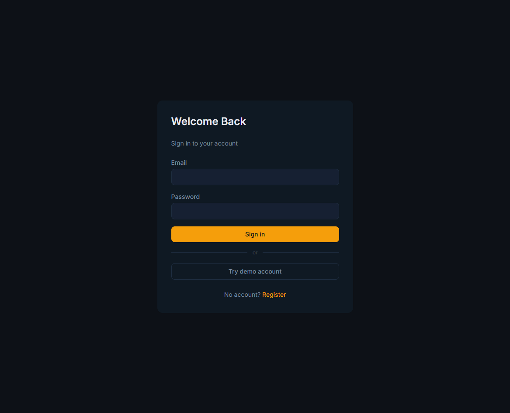
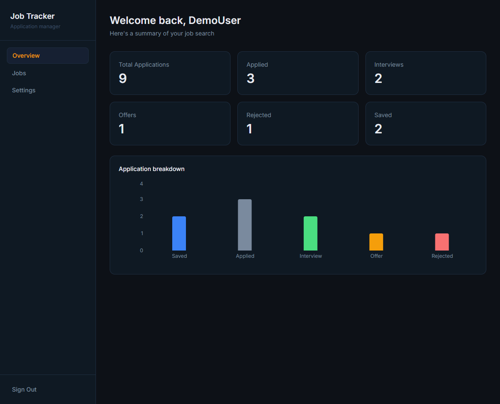
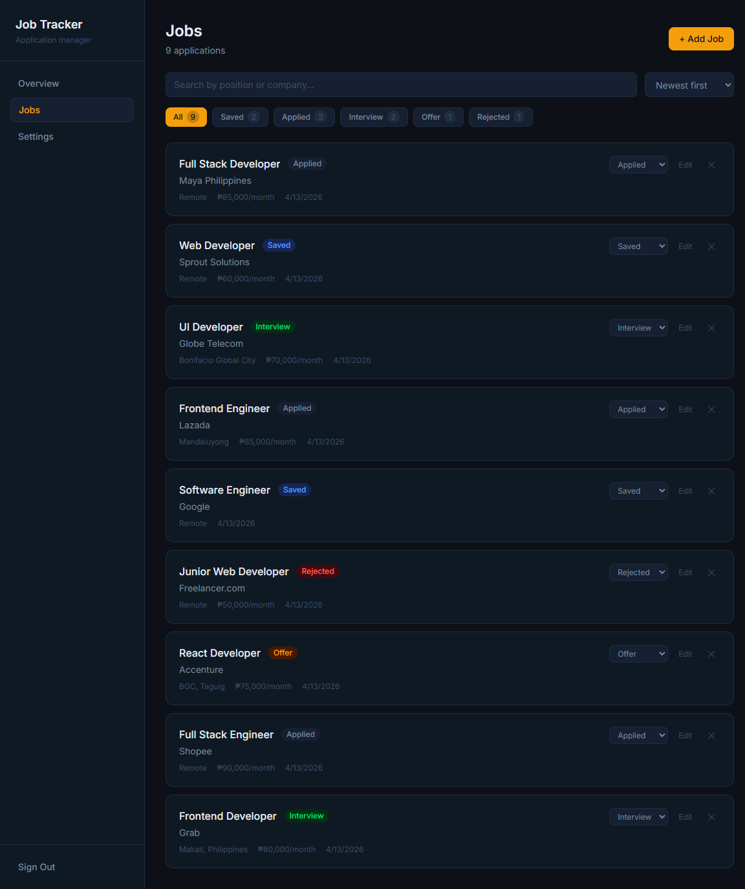
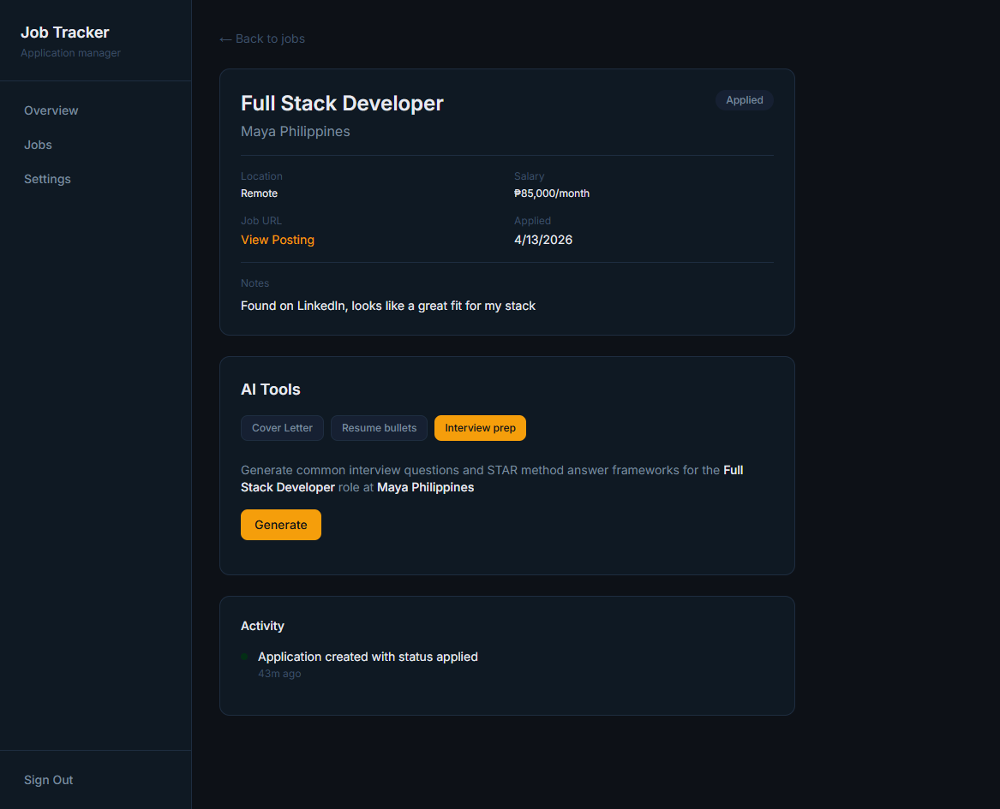
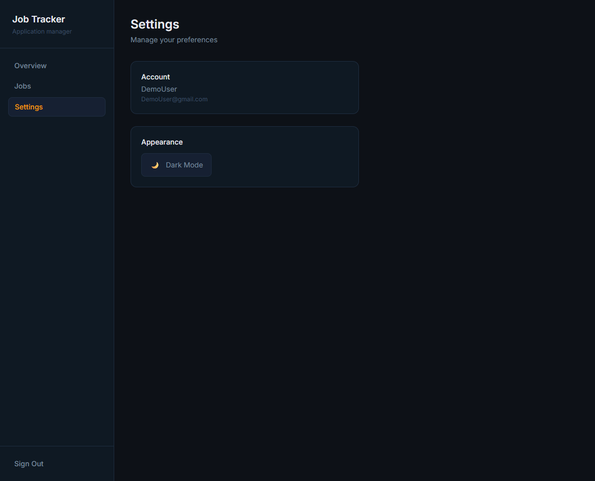

# Job Tracker 

A full-stack job application tracker built to help developers manage their job search. Track applications, monitor status changes, and leverage AI tools to generate cover letters, improve resume bullets, and prepare for interviews.

**Live Demo:** [https://job-tracker-srhfalcon.vercel.app/](https://job-tracker-srhfalcon.vercel.app/)

**Demo Account:**
| Role | Email | Password |
|------|-------|----------|
| Demo | DemoUser@gmail.com | DemoPassword123 |

A demo button is provided in the login page

---

## Screenshots







---

## Tech Stack

| Technology        | Purpose                                                 |
| ----------------- | ------------------------------------------------------- |
| Next.js 14        | Full-stack framework with App Router and server actions |
| TypeScript        | Type safety across frontend and backend                 |
| Tailwind CSS v4   | Utility-first styling                                   |
| Prisma            | Type-safe ORM                                           |
| PostgreSQL (Neon) | Serverless database                                     |
| NextAuth.js       | Authentication with JWT sessions                        |
| Groq (LLaMA 3.3)  | AI features — cover letter, resume, interview prep      |
| Recharts          | Application breakdown chart                             |
| Sonner            | Toast notifications                                     |
| next-themes       | Dark/light mode toggle                                  |

---

## Features

### Core

- JWT authentication — register, login, logout
- Demo account for instant access
- Protected routes with server-side session checks

### Job Management

- Add, edit, and delete job applications
- Track status — Saved, Applied, Interview, Offer, Rejected
- Filter by status with live counts
- Search by position or company
- Sort by date, company, or position
- Activity timeline per job — tracks status changes and updates

### Dashboard

- Stats overview — total, applied, interviews, offers, rejected, saved
- Application breakdown bar chart
- Skeleton loading state

### AI Tools (powered by Groq / LLaMA 3.3)

- **Cover letter generator** — paste a job description, get a tailored cover letter
- **Resume bullet improver** — paste your bullets, get impactful rewrites
- **Interview prep** — get 5 common questions with STAR method answer frameworks

### UX

- Dark and light mode with toggle
- Toast notifications for all actions
- Confirm modal before destructive actions
- Responsive layout — sidebar on desktop, bottom nav on mobile

---

## Local Setup

### Prerequisites

- Node.js 18+
- PostgreSQL database (or [Neon](https://neon.tech) free tier)
- [Groq](https://console.groq.com) API key (free)

### Installation

```bash
git clone https://github.com/yourusername/job-tracker.git
cd job-tracker
npm install
```

### Environment variables

Create a `.env.local` file at the root:

```env
DATABASE_URL=your-neon-connection-string
NEXTAUTH_URL=http://localhost:3000
NEXTAUTH_SECRET=your-secret
GROQ_API_KEY=your-groq-key
```

Also add `DATABASE_URL` to `.env` for Prisma migrations.

### Database setup

```bash
npx prisma migrate dev
npx prisma generate
```

### Run

```bash
npm run dev
```

Open [http://localhost:3000](http://localhost:3000).

---

## Project Structure

```
src/
├── app/
│   ├── (auth)/          # Login and register pages
│   ├── (dashboard)/     # Protected dashboard, jobs, settings
│   └── api/auth/        # NextAuth route handler
├── parts/               # Reusable components
│   └── jobs/            # Job-specific components and modals
├── actions/             # Server actions — jobs, auth, AI
├── lib/                 # Prisma client, NextAuth config, Groq client
└── types/               # TypeScript type declarations
```

---

## Deployment

Deployed on [Vercel](https://vercel.com). Database hosted on [Neon](https://neon.tech).
